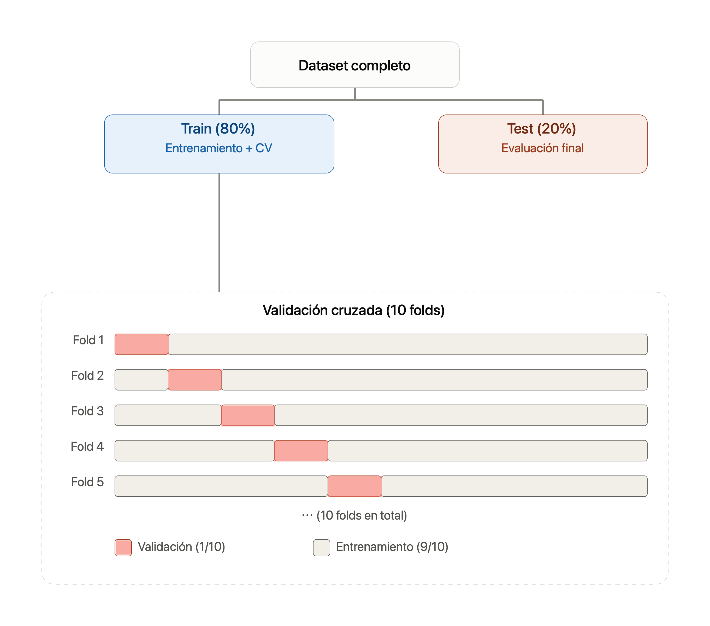

```{r setup, include=FALSE}
knitr::opts_chunk$set(
  echo = TRUE,
  message = FALSE,
  warning = FALSE,
  fig.align = "center",
  fig.width = 8,
  fig.height = 5
)
```

## Presentación

La rotación de los clientes es un problema para cualquier negocio de la industria de servicios. En la industria de servicios financieros, esto generalmente toma la forma de tarjetas de crédito. Ser capaz de determinar qué clientes son los más propensos a dejar de ser clientes y, por ende, ser capaz de comunicarse con esos clientes antes de que ocurra, podría darle al banco una ventaja competitiva en el mercado al mantener a más clientes usando sus servicios sobre sus competidores.

### Hipótesis

> El comportamiento transaccional del cliente (número de transacciones, monto total de transacciones), la utilización del crédito y las características demográficas (sexo, estado civil) son predictores significativos de la probabilidad de que un cliente deje de ser cliente.

### Razonamiento subyacente

- Un alto número de transacciones y montos transaccionados podría indicar un uso activo de la cuenta, reduciendo la probabilidad de que el cliente deje de ser cliente.
- Cambios significativos en los montos de transacciones pueden indicar variabilidad en el comportamiento del cliente, lo que podría ser un indicador de insatisfacción o problemas financieros.
- La utilización del crédito es un indicador directo de cómo el cliente maneja su crédito, lo que podría influir en su decisión de mantener la cuenta.
- Las variables demográficas pueden influir en el comportamiento financiero y la estabilidad del cliente. Por ejemplo, el estado civil puede afectar la estabilidad financiera y el sexo puede estar relacionado con diferencias en el comportamiento financiero.

Dataset Source: https://www.kaggle.com/sakshigoyal7/credit-card-customers

### Objetivo

Plantear unas estrategia de clasificación de aprendizaje supervisado:

Desarrollar un modelo de machine learning utilizando regresión logística, para predecir la probabilidad de que un cliente deje de ser cliente (Attrition_Flag) basándose en variables relacionadas con el comportamiento transaccional, la utilización del crédito y las características demográficas.

---

## Los datos

### Indice de variables disponibles

1. **ID**: Identificador único de cada cliente (Cuantitativa).
2. **Attrition_Flag**: Estado de la cuenta del cliente (Existente o Dejó de ser cliente) (Cualitativa).
3. **Customer_Age**: Edad del cliente en años (Cuantitativa).
4. **Gender**: Género del cliente (M para masculino, F para femenino) (Cualitativa).
5. **Dependent_count**: Número de dependientes que tiene el cliente (Cuantitativa).
6. **Education_Level**: Nivel educativo del cliente (High School, Graduate, etc.) (Cualitativa).
7. **Marital_Status**: Estado civil del cliente (Married, Single, etc.) (Cualitativa).
8. **Income_Category**: Categoría de ingresos del cliente (Less than $40K, $60K - $80K, etc.) (Cualitativa).
9. **Card_Category**: Categoría de la tarjeta del cliente (Blue, Silver, etc.) (Cualitativa).
10. **Months_on_book**: Meses que el cliente ha estado con la entidad financiera (Cuantitativa).
11. **Total_Relationship_Count**: Número total de productos que tiene el cliente con la entidad (Cuantitativa).
12. **Months_Inactive_12_mon**: Número de meses que el cliente ha estado inactivo en los últimos 12 meses (Cuantitativa).
13. **Contacts_Count_12_mon**: Número de veces que el cliente ha contactado a la entidad en los últimos 12 meses (Cuantitativa).
14. **Credit_Limit**: Límite de crédito del cliente (Cuantitativa).
15. **Total_Revolving_Bal**: Saldo rotativo total del cliente (Cuantitativa).
16. **Avg_Open_To_Buy**: Promedio de crédito disponible del cliente (Cuantitativa).
17. **Total_Amt_Chng_Q4_Q1**: Cambio total en el monto transaccionado del cuarto al primer trimestre (Cuantitativa).
18. **Total_Trans_Amt**: Monto total de transacciones realizadas por el cliente (Cuantitativa).
19. **Total_Trans_Ct**: Número total de transacciones realizadas por el cliente (Cuantitativa).
20. **Total_Ct_Chng_Q4_Q1**: Cambio total en el número de transacciones del cuarto al primer trimestre (Cuantitativa).
21. **Avg_Utilization_Ratio**: Promedio de utilización del crédito del cliente (Cuantitativa).

```{r}
library(tidyverse)
datos <- read_delim(
  "bank.csv",
  delim = ";",
  locale = locale(decimal_mark = ".")
)

datos |> dim() 
datos |> glimpse()
```

```{r}
source("resumen.R")
datos |> 
  select(-CLIENTNUM) |> 
  resumen()
```

## Limpieza y transformación de datos

### Duplicados

```{r}
datos |> 
  duplicated() |> 
  sum()
```

### NA

```{r}
datos |> 
  summarise(across(everything(), ~ sum(is.na(.)))) |> 
  # everything() todas las columnas
  pivot_longer(everything(), names_to = "variable", values_to = "n_NA") |>
  arrange(desc(n_NA))
```


### Outliers

```{r}
datos |> 
  select(where(is.numeric)) |> 
  pivot_longer(everything(), names_to = "variable", values_to = "valor") |> 
  ggplot(aes(x = valor, y = variable)) +
  geom_boxplot(fill = "#4C72B0", alpha = 0.7, outlier.colour = "firebrick") +
  facet_wrap(~ variable, scales = "free", ncol = 3) +
  labs(
    title = "Diagramas de Caja de Variables Numéricas",
    x = NULL, y = NULL
  ) +
  theme_minimal() +
  theme(
    strip.text = element_text(face = "bold"),
    axis.text.y = element_blank()
  )
```

Los diagramas de caja muestran que las variables:

- Credit_Limit: Límite de crédito del cliente
- Avg_Open_To_Buy: Promedio de crédito disponible del cliente
- Total_Trans_Amt: Monto total de transacciones realizadas por el cliente

Presentan un comportamiento asimétrico, con sesgo positivo o a la derecha, que implica que la mayoría de las cuentan muestras mas bien valores bajos y unas pocas, valores excesivamente altos (outliers), que es un comportamiento típico de variables asociadas a poder adquisitivo de los individuos.

El estudio trabajará inicialmente con la totaliad de los datos, incluidos los outliers.


## Análisis Exploratorio de los Datos (EDA)

Variable respuesta: Attrition_Flag

```{r}
datos |> 
  count(Attrition_Flag) |> 
  mutate(pct = n / sum(n) * 100) |> 
  ggplot(aes(x = Attrition_Flag, y = n, fill = Attrition_Flag)) +
  geom_col() +
  geom_text(aes(label = paste0(round(pct, 1), "%")), vjust = -0.5) +
  labs(title = "Distribución de la Variable Respuesta", x = NULL, y = "Clientes") +
  theme_minimal() +
  theme(legend.position = "none")
```

El gráfico evidencia un fuerte desbalance de clases en la variable respuesta: el 83.9% de los clientes son "Existing Customer" frente a solo 16.1% de "Attrited Customer", lo que anticipa la necesidad de tratar este desbalance durante el modelado.

### Bivariado: Numéricas vs. Attrition_Flag

```{r}
datos |> 
  select(where(is.numeric), Attrition_Flag, -CLIENTNUM) |> 
  pivot_longer(-Attrition_Flag, names_to = "variable", values_to = "valor") |> 
  ggplot(aes(x = Attrition_Flag, y = valor, fill = Attrition_Flag)) +
  geom_boxplot(alpha = 0.7, outlier.size = 0.7) +
  facet_wrap(~ variable, scales = "free_y", ncol = 3) +
  labs(title = "Variables Numéricas según Estado de Attrition", x = NULL, y = NULL) +
  theme_minimal() +
  theme(legend.position = "none", strip.text = element_text(face = "bold"))
```


El comportamiento transaccional muestra la separación más marcada entre grupos: los clientes que abandonan (Attrited Customer) presentan una mediana notablemente más baja en **Total_Trans_Ct**, **Total_Trans_Amt** y **Total_Revolving_Bal**, junto con menor **Total_Ct_Chng_Q4_Q1** y **Avg_Utilization_Ratio** que los clientes existentes. 

Esto es consistente con la hipótesis planteada: una menor actividad transaccional y utilización de crédito se asocia con mayor probabilidad de fuga. También se observa que los clientes que abandonan tienden a tener menor **Total_Relationship_Count** (menos productos contratados con el banco) y ligeramente más **Contacts_Count_12_mon** y **Months_Inactive_12_mon**, lo que sugiere una relación más débil y distante con la entidad previo al abandono.

En contraste, **Customer_Age**, **Months_on_book**, **Dependent_count**, **Credit_Limit** y **Avg_Open_To_Buy** muestran distribuciones prácticamente superpuestas entre ambos grupos, indicando que aportarían poco poder predictivo por sí solas en el modelo logit — su inclusión debería evaluarse en conjunto con las variables transaccionales antes que como predictores individuales fuertes


### Categóricas vs. Attrition_Flag (Pruebas de Independencia)

```{r}
categoricas_vars <- c("Gender", "Education_Level", "Marital_Status", 
                       "Income_Category", "Card_Category")

resultado_chi <- categoricas_vars |> 
  map_dfr(function(var) {
    tabla <- table(datos[[var]], datos$Attrition_Flag)
    test <- chisq.test(tabla)
    tibble(
      variable = var,
      chi2 = as.numeric(test$statistic),
      p_value = test$p.value,
      significativa = if_else(p_value < 0.05, "Sí", "No")
    )
  })

resultado_chi
```


La permanencia del cliente depende del genero y del nivel de ingreso. 

### Multivariado: Correlación entre Variables Cuantitativas

```{r}
datos |> 
  select(where(is.numeric), -CLIENTNUM) |> 
  cor() |> 
  as.data.frame() |> 
  rownames_to_column("var1") |> 
  pivot_longer(-var1, names_to = "var2", values_to = "correlacion") |> 
  ggplot(aes(x = var1, y = var2, fill = correlacion)) +
  geom_tile() +
  geom_text(aes(label = round(correlacion, 2)), size = 2.8) +
  scale_fill_gradient2(low = "steelblue", mid = "white", high = "firebrick", midpoint = 0) +
  labs(title = "Matriz de Correlación de Variables Numéricas", x = NULL, y = NULL) +
  theme_minimal() +
  theme(axis.text.x = element_text(angle = 45, hjust = 1))
```

1. **Months_on_book y Customer_Age (0.79)**:
   - Existe una fuerte correlación positiva entre la edad del cliente y los meses que ha estado con la entidad financiera. Esto sugiere que los clientes de mayor edad tienden a tener una relación más larga con el banco.

2. **Total_Trans_Ct y Total_Trans_Amt (0.81)**:
   - Hay una fuerte correlación positiva entre el número total de transacciones y el monto total de transacciones. Esto indica que, en general, a medida que aumenta el número de transacciones, también lo hace el monto total transaccionado.

3. **Avg_Open_To_Buy y Credit_Limit (1.00)**:
   - Existe una correlación perfecta positiva entre el crédito disponible promedio y el límite de crédito. Esto tiene sentido ya que el crédito disponible es directamente proporcional al límite de crédito otorgado al cliente.

4. **Avg_Utilization_Ratio y Credit_Limit (-0.44)**:
   - Hay una correlación negativa moderada entre la ratio de utilización promedio y el límite de crédito. Esto sugiere que los clientes con límites de crédito más altos tienden a utilizar una menor proporción de su crédito disponible.

5. **Avg_Utilization_Ratio y Total_Revolving_Bal (0.56)**:
   - Existe una correlación positiva moderada entre la ratio de utilización promedio y el saldo rotativo total. Esto indica que los clientes con saldos rotativos más altos tienden a utilizar una mayor proporción de su crédito disponible.

6. **Total_Relationship_Count y Total_Trans_Amt (-0.35)**:
   - Hay una correlación negativa moderada entre el número total de productos que tiene el cliente con la entidad y el monto total de transacciones. Esto sugiere que los clientes con más productos pueden transaccionar menos en promedio.


## Análisis Predictivo: Modelado Regresión Logística

### Preparación de los factores

```{r}
datos <- datos |> 
  mutate(
    Attrition_Flag = factor(Attrition_Flag, 
                             levels = c("Attrited Customer", "Existing Customer")),
    Gender = factor(Gender),
    Marital_Status = factor(Marital_Status),
    Card_Category = factor(Card_Category),
    Education_Level = factor(Education_Level),
    Income_Category = factor(
      Income_Category,
      levels = c("Less than $40K", "$40K - $60K", "$60K - $80K", 
                 "$80K - $120K", "$120K +", "Unknown"),
      ordered = FALSE  # ordinal solo para visualización, no como predictor ordinal en el logit
    )
  )

datos |> select(where(is.factor)) |> map(levels)

```

### Splits

```{r}
library(tidymodels)

set.seed(123)
split <- initial_split(datos, prop = 0.8, strata = Attrition_Flag)
train <- training(split)
test  <- testing(split)

### Validación cruzada (10-fold, estratificada)

set.seed(123)
folds <- vfold_cv(train, v = 10, strata = Attrition_Flag)
```


::: {.callout-note}
`strata = Attrition_Flag` en `initial_split()` y en `vfold_cv()` asegura que la proporción 83.9/16.1 se mantenga en cada partición y en cada fold — clave para no distorsionar más el desbalance ya existente.

`prop = 0.8` deja 20% para el test final.
:::



### Recipes de preprocesamiento

Modelo Completo: todas las predictoras, sacando ID y la colinealidad (Credit_Limit / Avg_Open_To_Buy, redundantes con Income_Category).

```{r}
# Modelo Completo
rec_completo <- recipe(Attrition_Flag ~ ., data = train) |>
  step_rm(CLIENTNUM, Credit_Limit, Avg_Open_To_Buy) |>
  step_dummy(all_nominal_predictors()) |>
  step_zv(all_predictors()) |>
  step_normalize(all_numeric_predictors())
```

Modelo parsimonioso: incorpora únicamente las variables con mayor poder discriminante identificado en el análisis exploratorio —comportamiento transaccional (`Total_Trans_Ct`, `Total_Trans_Amt`, `Total_Ct_Chng_Q4_Q1`), utilización y saldo de crédito (`Avg_Utilization_Ratio`, `Total_Revolving_Bal`), vínculo con el banco (`Total_Relationship_Count`, `Months_Inactive_12_mon`, `Contacts_Count_12_mon`) y características cualitativas (`Gender`, `Income_Category`)—, priorizando interpretabilidad y parsimonia sobre la inclusión exhaustiva de predictores del modelo completo.

```{r}
# Modelo Parsimonioso
rec_parsimonioso <- recipe(
  Attrition_Flag ~ Total_Trans_Ct + Total_Trans_Amt + Total_Ct_Chng_Q4_Q1 +
    Total_Revolving_Bal + Avg_Utilization_Ratio + Total_Relationship_Count +
    Months_Inactive_12_mon + Contacts_Count_12_mon + Gender + Income_Category,
  data = train
) |>
  step_dummy(all_nominal_predictors()) |> 
  step_zv(all_predictors()) |> 
  step_normalize(all_numeric_predictors())
```

::: {.callout-note}
`zv = zero variance` (varianza cero). Elimina cualquier predictor que haya quedado con el mismo valor en todas las filas — es decir, que no varíe. Esto puede pasar por ejemplo con una dummy que, dentro de un fold específico de la validación cruzada, quedó en todo ceros porque esa categoría no apareció en ese subconjunto de datos. Sin este paso, el modelo rompería en ese fold con un error de matriz singular.
:::

### Especificación del modelo

```{r}
logit_spec <- logistic_reg() |> 
  set_engine("glm") |> 
  set_mode("classification")
```

### Workflows

```{r}
wf_completo <- workflow() |> 
  add_recipe(rec_completo) |> 
  add_model(logit_spec)

wf_parsimonioso <- workflow() |> 
  add_recipe(rec_parsimonioso) |> 
  add_model(logit_spec)
```

### Métricas para evaluación (entrenamiento)

```{r}
metricas <- metric_set(roc_auc, sensitivity, specificity, f_meas, accuracy)
```

### Ajuste y evaluación por validación cruzada

```{r}
set.seed(123)
res_completo <- fit_resamples(
  wf_completo,
  resamples = folds,
  metrics = metricas,
  control = control_resamples(save_pred = TRUE)
)

set.seed(123)
res_parsimonioso <- fit_resamples(
  wf_parsimonioso,
  resamples = folds,
  metrics = metricas,
  control = control_resamples(save_pred = TRUE)
)
```

### Comparación de métricas

```{r}
bind_rows(
  collect_metrics(res_completo) |> mutate(modelo = "Completo"),
  collect_metrics(res_parsimonioso) |> mutate(modelo = "Parsimonioso")
) |> 
  select(modelo, .metric, mean, std_err) |> 
  arrange(.metric, modelo)
```

::: {.callout-note}
## Interpretación de la tabla de métricas

1. Diferencias entre modelos: mínimas y probablemente no significativas. El Modelo Completo supera levemente al Parsimonioso en accuracy (89.9% vs 89.4%), roc_auc (0.911 vs 0.908), f_meas (0.629 vs 0.615) y sensitivity (0.546 vs 0.526), mientras que el Parsimonioso es marginalmente mejor en specificity (0.965 vs 0.964). Sin embargo, las diferencias son del orden de 1-2 puntos porcentuales como máximo, y los std_err (todos entre 0.002 y 0.013) indican que los intervalos de ambos modelos se solapan ampliamente. En la práctica, **esto significa que agregar las ~9 variables adicionales del modelo completo (edad, antigüedad, dependientes, etc.) no aporta poder predictivo relevante sobre las 10 variables del parsimonioso**.
2. Aplicando el principio de parsimonia (como planteamos en la estrategia inicial), **esta evidencia respalda quedarnos con el Modelo Parsimonioso: rinde prácticamente igual con la mitad de los predictores**, es más interpretable para explicarle al negocio qué impulsa el abandono, y reduce el riesgo de sobreajuste y de coeficientes inestables por colinealidad que ya habíamos identificado en el modelo completo.
3. ⚠️ De todos los clientes que efectivamente abandonaron el banco, ¿a cuántos logró detectar el modelo? Con sensitivity (recall) ≈ 0.53-0.55, **el modelo solo detecta correctamente a la mitad de los clientes que efectivamente van a abandonar el banco** — el resto queda "escondido" entre los que el modelo predice como clientes existentes (falsos negativos). Esto contrasta con la specificity muy alta (~0.96), que refleja lo fácil que es identificar a quienes no abandonan (la clase mayoritaria). Este patrón es **típico de datos desbalanceados con el umbral de clasificación por defecto (0.5): el modelo tiende a favorecer la clase mayoritaria**.
:::

> **Implicancia práctica**: si el objetivo del banco es anticiparse al abandono (que es el objetivo planteado), una sensibilidad de ~0.53 probablemente sea insuficiente — se estarían perdiendo casi la mitad de los clientes en riesgo real. Esto motiva un paso siguiente natural: explorar el ajuste del umbral de clasificación (bajarlo de 0.5 a un valor que priorice recall sobre precisión) o considerar técnicas de balanceo de clases, evaluando el trade-off resultante en sensibilidad vs. especificidad con la curva ROC o una curva precision-recall.

## Alternativa de Mejora

Hay tres estrategias posibles

- Bajar el umbral de clasificación: 

En vez de clasificar como "Attrited" solo cuando P(Attrited) > 0.5, se reduce el corte — por ejemplo a 0.3. Esto hace que el modelo sea "más generoso" clasificando gente como riesgo de abandono, capturando más verdaderos positivos... pero a costa de generar más falsos positivos.

- Balancear las clases en el entrenamiento:

1. Submuestreo (undersampling): descartar aleatoriamente parte de los "Existing" hasta emparejar cantidades.
2. Sobremuestreo (oversampling): duplicar o generar sintéticamente más casos de "Attrited" (técnicas como SMOTE).

- Ponderar la función de pérdida (class weights):

> En vez de cambiar los datos, se le dice al algoritmo "cada error sobre un Attrited real pesa más que un error sobre un Existing" al momento de estimar los coeficientes.

### Ponderando la función de pérdida

En una regresión logística estándar, la función de log-verosimilitud que se maximiza trata a todas las observaciones con el mismo peso. Con clases desbalanceadas (84% Existing / 16% Attrited), esto hace que el ajuste "convenga" más prediciendo la clase mayoritaria, ya que así se minimiza el error global aunque se sacrifiquen los positivos minoritarios.
La solución es ponderar la función de pérdida: se le asigna un peso mayor a cada observación de la clase minoritaria (Attrited) y un peso menor a las de la clase mayoritaria (Existing), de forma tal que —en términos efectivos— el algoritmo "vea" una situación más balanceada al momento de estimar los coeficientes. El peso estándar (usado por parsnip/glm vía case_weights) es inversamente proporcional a la frecuencia de cada clase:

$$w_i = {n_{total}\over 2*n_{clases}}$$

Así, la clase minoritaria recibe pesos > 1 y la mayoritaria pesos < 1, sin necesidad de duplicar ni descartar observaciones (a diferencia del sobre/submuestreo)

```{r}
### Cálculo de pesos

train <- train |> 
  mutate(
    case_wts = case_when(
      Attrition_Flag == "Attrited Customer" ~ 
        n() / (2 * sum(Attrition_Flag == "Attrited Customer")),
      Attrition_Flag == "Existing Customer" ~ 
        n() / (2 * sum(Attrition_Flag == "Existing Customer"))
    ),
    case_wts = importance_weights(case_wts)
  )
```

::: {.callout-note}
## Cómo se lee

Para cada fila, si `Attrition_Flag` es Attrited Customer, asignale este valor; si es Existing Customer, asignale este otro valor". Cada línea tiene la forma condición ~ valor_a_asignar (la `~` separa condición de resultado).
:::

## Regresión Logística Ponderada 

```{r}
rec_parsimonioso_pond <- recipe(
  Attrition_Flag ~ Total_Trans_Ct + Total_Trans_Amt + Total_Ct_Chng_Q4_Q1 +
    Total_Revolving_Bal + Avg_Utilization_Ratio + Total_Relationship_Count +
    Months_Inactive_12_mon + Contacts_Count_12_mon + Gender + Income_Category +
    case_wts,
  data = train
) |>
  step_dummy(all_nominal_predictors()) |>
  step_zv(all_predictors()) |>
  step_normalize(all_numeric_predictors())

### Workflow ponderado

wf_parsimonioso_pond <- workflow() |> 
  add_case_weights(case_wts) |>  # Esta linea agrega los ponderadores
  add_recipe(rec_parsimonioso_pond) |> 
  add_model(logit_spec)

### Folds (re-generados sobre el train actualizado con case_wts)

set.seed(123)
folds_pond <- vfold_cv(train, v = 10, strata = Attrition_Flag)

### Validación cruzada

set.seed(123)
res_parsimonioso_pond <- fit_resamples(
  wf_parsimonioso_pond,
  resamples = folds_pond,
  metrics = metricas,
  control = control_resamples(save_pred = TRUE)
)

### Comparación: Parsimonioso sin ponderar vs. ponderado

bind_rows(
  collect_metrics(res_parsimonioso) |> mutate(modelo = "Parsimonioso"),
  collect_metrics(res_parsimonioso_pond) |> mutate(modelo = "Parsimonioso Ponderado")
) |> 
  select(modelo, .metric, mean, std_err) |> 
  arrange(.metric, modelo)
```


### Conclusiones sobre la propuesta de mejora

1. El roc_auc prácticamente no cambió (0.908 vs 0.910, diferencia dentro del margen de error). Esto confirma exactamente lo que anticipamos: la ponderación no mejora ni empeora la capacidad de discriminación subyacente del modelo (qué tan bien separa las probabilidades entre clases) — solo mueve dónde cae el umbral de decisión al clasificar. El modelo "sabe" lo mismo; ahora decide distinto.
2. El trade-off funcionó exactamente como se esperaba, y de forma muy marcada. La sensitivity saltó de 0.526 a 0.837 — un salto enorme. Ahora el modelo detecta correctamente a ~84 de cada 100 clientes que efectivamente abandonan, contra ~53 antes. A cambio, la specificity bajó de 0.965 a 0.822: ahora hay más clientes que en realidad se iban a quedar, pero el modelo los marca (erróneamente) como en riesgo de fuga.
3. El accuracy bajó notoriamente (89.4% → 82.4%), pero esto no es necesariamente malo — es la consecuencia esperada y hasta deseada de dejar de favorecer a la clase mayoritaria. Recordá que un modelo que prediga "todos existentes" ya tenía ~84% de accuracy sin detectar ni un solo abandono; que el accuracy baje un poco mientras la detección real de fuga sube tanto es una señal de que el modelo dejó de ser "vago" con la clase minoritaria.
4. El f_meas (F1) se mantuvo casi igual (0.615 vs 0.605) porque combina precisión y sensibilidad, y acá ambas componentes se movieron en direcciones opuestas: mejoró mucho la sensibilidad, pero como ahora hay más falsos positivos, la precisión (de los que el modelo marca como "Attrited", cuántos lo son realmente) empeoró, compensándose casi por completo en el promedio armónico.

::: {.callout-note}
## Cuál conviene?

- Si el costo de no detectar a un cliente que se va (perderlo sin poder ofrecerle nada a tiempo) es mucho mayor que el costo de contactar de más a un cliente que en realidad se iba a quedar (por ejemplo, una llamada o una promoción de retención, relativamente barata) → el Parsimonioso Ponderado es claramente superior, porque detecta 84% de la fuga real a cambio de un costo operativo menor.
- Si el banco tiene capacidad limitada para hacer seguimiento personalizado (por ejemplo, solo puede llamar a un número acotado de clientes por mes) y necesita que cada alerta sea muy confiable → el Parsimonioso original podría preferirse, priorizando precisión sobre cobertura.

Dado el objetivo planteado desde el inicio del proyecto (anticiparse al abandono para poder actuar antes de que el cliente se vaya), el criterio de negocio favorece fuertemente maximizar la detección de fuga real. Por eso, mi recomendación sería avanzar con el Modelo Parsimonioso Ponderado como candidato principal, dejando planteado en el informe que esta elección refleja una decisión de negocio explícita (priorizar recall sobre precisión), no solo un criterio estadístico.
:::

## Evaluación final en el grupo de testeo

```{r}
# Ajuste del modelo final sobre todo el train
modelo_final <- wf_parsimonioso_pond |> fit(data = train)
```


El test necesita una columna "case_wts" porque la recipe la declaró como variable (rol "case_weights").

```{r}
test <- test |> 
  mutate(case_wts = importance_weights(rep(1, n())))
```

Predicciones sobre el test (datos no vistos por el modelo)

```{r}
pred_test <- test |> 
  select(Attrition_Flag) |> 
  bind_cols(predict(modelo_final, new_data = test, type = "class")) |> 
  bind_cols(predict(modelo_final, new_data = test, type = "prob"))

pred_test |> head()
```

Matriz de confusión

```{r}
pred_test |> 
  conf_mat(truth = Attrition_Flag, estimate = .pred_class)
```

Métricas finales (mismo metric_set usado en la comparación por CV)

```{r}
pred_test |> 
  metricas(
    truth = Attrition_Flag, 
    estimate = .pred_class, 
    `.pred_Attrited Customer`
  )
```


Curva ROC

```{r}
pred_test |> 
  roc_curve(truth = Attrition_Flag, `.pred_Attrited Customer`) |> 
  autoplot() +
  labs(title = "Curva ROC - Modelo Parsimonioso Ponderado (Test)")

```


Interpretación de la Evaluación Final en Test

1. Consistencia con la validación cruzada — la señal más importante. Las métricas en test (accuracy 0.819, sensitivity 0.859, specificity 0.812, roc_auc 0.913) son prácticamente idénticas a las que había arrojado la validación cruzada del Parsimonioso Ponderado (accuracy 0.824, sensitivity 0.837, specificity 0.822, roc_auc 0.910). Esto es una muy buena noticia metodológica: confirma que el proceso de selección de modelo (hecho enteramente sobre train/CV, sin tocar test) fue honesto y no hubo sobreajuste ni filtración de información — el modelo generaliza a datos nuevos tal como la CV había anticipado.

2. Matriz de confusión: De los 326 clientes que realmente abandonaron en el conjunto de test, el modelo identificó correctamente a 280 (sensitivity = 85.9%) y dejó pasar 46 sin detectar (falsos negativos). A cambio, de los 1700 clientes que en realidad se quedaron, marcó erróneamente a 320 (falsos positivos) — el "costo" que asumimos a propósito al ponderar el modelo, bajo el supuesto de que contactar de más a un cliente fiel es mucho más barato que perder a uno sin darse cuenta.

3. La curva ROC confirma una buena capacidad discriminante. Con AUC = 0.913, la curva se aleja claramente de la diagonal (clasificador aleatorio) y se acerca a la esquina superior izquierda — el modelo alcanza sensibilidad alta (~0.80) con una tasa de falsos positivos todavía moderada (~0.15-0.20 en el eje horizontal), lo cual es un buen desempeño para un problema con clases desbalanceadas.

4. Vínculo con la hipótesis inicial. Estos resultados respaldan la hipótesis del proyecto: las variables de comportamiento transaccional y utilización de crédito —que fueron justamente las que dominan el modelo parsimonioso— resultan predictores sólidos de la fuga, alcanzando un modelo que detecta a más de 8 de cada 10 clientes en riesgo real.

---

```{r}
# Extracción de coeficientes

tidy(modelo_final, exponentiate = FALSE) |> 
  arrange(desc(abs(estimate)))

# Odds Ratios (más interpretable para el informe)

tidy(modelo_final, exponentiate = TRUE) |> 
  filter(term != "(Intercept)") |> 
  arrange(desc(estimate)) |> 
  mutate(across(where(is.numeric), ~ round(.x, 3)))
```

```{r}
### Gráfico de Odds Ratios

tidy(modelo_final, exponentiate = TRUE, conf.int = TRUE) |> 
  filter(term != "(Intercept)") |> 
  ggplot(aes(x = estimate, y = reorder(term, estimate))) +
  geom_point(color = "#4C72B0", size = 2) +
  geom_errorbarh(aes(xmin = conf.low, xmax = conf.high), height = 0.2, color = "#4C72B0") +
  geom_vline(xintercept = 1, linetype = "dashed", color = "firebrick") +
  labs(
    title = "Odds Ratios del Modelo Parsimonioso Ponderado",
    x = "Odds Ratio", y = NULL
  ) +
  scale_x_log10() +
  theme_minimal()
```


::: {.callout-note}
##  OR > 1 significa "aumenta la probabilidad de seguir siendo cliente"

A la derecha de la línea, la variable aumenta la probabilidad de seguir siendo cliente; a la izquierda, la disminuye. Como los predictores numéricos están estandarizados (step_normalize()), cada OR representa el efecto de un aumento de 1 desvío estándar en esa variable.
:::

