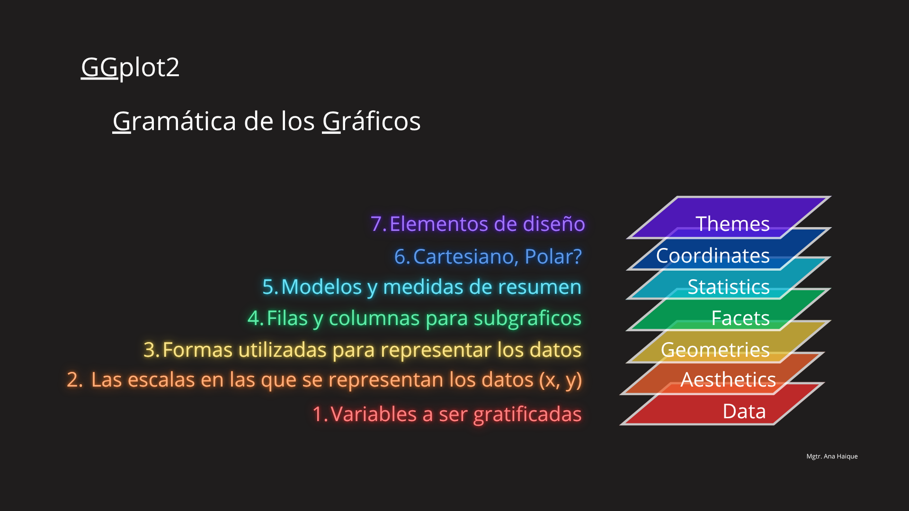

```{r}
#| label: setup
#| include: false

knitr::opts_chunk$set(
  echo = TRUE,
  message = FALSE,
  warning = FALSE,
  fig.width = 8,
  fig.height = 5,
  dpi = 110
)
```

## Por qué visualizar importa

Una visualización no decora el análisis: produce conocimiento que los resúmenes numéricos no producen. Wickham (2014) señala que los estadísticos de resumen **comprimen** la información y que esa compresión puede esconder patrones, outliers y anomalías. La consecuencia operativa es directa: comunicar un análisis solo con tablas es entregar una descripción parcial, a veces engañosa.

## Jerarquía de codificación visual — Cleveland & McGill (1984)

No todos los canales visuales comunican igual de bien. Ordenados de mayor a menor precisión perceptiva:

| Canal | Ejemplo típico | Cuándo usarlo |
|----|----|----|
| **Posición** (x, y) | Scatter, dotplot | Cuando la variable es la más importante del gráfico |
| **Longitud** | Barras, lollipop | Comparar magnitudes entre categorías |
| **Ángulo / pendiente** | Pie chart, líneas | Solo si no queda otra (los ángulos se perciben mal) |
| **Área** | Burbujas, treemaps | Codificar una variable adicional "secundaria" |
| **Color / tono** | Heatmap, categorías | Agrupar o distinguir, NO comparar magnitudes |

## Que gráfico usar?

| Querés mostrar... | Usá... | Ejemplo |
|----|----|----|
| Distribución de 1 variable | Histograma / boxplot / density | `cpu_score` por tipo (facetado) |
| Comparar 1 variable entre grupos | Boxplot / violin / bar con error | `ram_gb` por tipo |
| Relación entre 2 numéricas | Scatter | `precio_usd` vs `cpu_score` |
| Composición / parte del todo | Barras stacked (NO pie) | `marca` desglosado por `tipo` |
| 3+ variables a la vez | Color + tamaño + facetas | Bubble plot `precio × cpu × ram × tipo` |
| Cambio en el tiempo | Línea (no tenemos tiempo, otro dataset) | — |

## Los datos

Dataset `laptops.csv`de **\~300 laptops** muestra las ventas de un gran distribuidor del mercado actual. Tiene 5 variables numéricas, en unidades distintas (ideal para practicar escalado y scatter plots) y 2 variables categóricas.

Nos preguntamos *"¿Qué tipo de laptop es más cara?"*.

## 1. Cargar datos

```{r}
#| label: cargar-datos

library(tidyverse)

laptops <- read_csv("laptops.csv")

laptops
```

::: callout-note
`cpu_score` es un puntaje normalizado de rendimiento del CPU de la laptop, en escala 0–100 donde 0 es el peor y 100 el mejor.
:::

## 2. Estructura del dataset

```{r}
#| label: estructura

glimpse(laptops)
```

### Conteo por tipo

```{r}
#| label: count-tipo

laptops |> 
  count(tipo, sort = TRUE)
```

### Conteo por marca

```{r}
#| label: count-marca

laptops |> 
  count(marca, sort = TRUE)
```

## 3. Datos faltantes

```{r}
#| label: faltantes

laptops |> 
  summarise(across(everything(), ~ sum(is.na(.)))) |> 
  pivot_longer(everything(), names_to = "variable", values_to = "n_na") |> 
  arrange(desc(n_na))
```

Hay `r sum(is.na(laptops$peso_kg))` valores faltantes en `peso_kg` y `r sum(is.na(laptops$cpu_score))` en `cpu_score` (\~3-4% cada uno).

## 4. Estadísticas descriptivas por tipo

```{r}
#| label: resumen-tipo

laptops |> 
  group_by(tipo) |> 
  summarise(
    n            = n(),
    ram_media    = mean(ram_gb),
    cpu_medio    = mean(cpu_score, na.rm = TRUE),
    pantalla_med = mean(pantalla_pulgadas),
    peso_medio   = mean(peso_kg, na.rm = TRUE),
    precio_medio = mean(precio_usd),
    .groups = "drop"
  ) |> 
  arrange(precio_medio)
```

**Lectura rápida:** los `Workstation` tienen la mayor RAM y precio; los `Gaming` pesan más; los `Ultrabook` son los más livianos y de pantalla más chica; los `Budget` tienen specs modestas y precio bajo.

## 5. Visualizaciones



### 5.1.1 Primer Layer:

```{r}
#| label: Data Layer
#| fig-cap: "Data"

ggplot(data = laptops)
```

### 5.1.2. Segunda Layer:

```{r}
#| label: Aesthetic Layer
#| fig-cap: "Aesthetics"

ggplot(laptops, aes(x = peso_kg, y = precio_usd, color = tipo, shape = tipo)) 
```

### 5.1.3. Tercera Layer:

```{r}
#| label: Geom Layer
#| fig-cap: "Geometrics"

ggplot(laptops, aes(x = peso_kg, y = precio_usd)) +
  geom_point(size = 3, alpha = 0.8)
```

Mejoramos la salida agregando aesthetics y otra layers

```{r}
#| label: Mejorado
#| fig-cap: "Mejorado"

ggplot(laptops, aes(x = peso_kg, y = precio_usd, color = tipo)) +
  geom_point(size = 3, alpha = 0.8) +
  labs(
    title    = "Relación entre peso y precio",
    subtitle = "Mas peso mas valor",
    x = "Peso (kg)", y = "Precio (USD)",
    color = "Tipo"
  ) 
```

### 5.1.1 Scatter 1: Peso vs Precio (shape)

```{r}
#| label: scatter-peso-precio
#| fig-cap: "Relación entre peso y precio, coloreado por tipo"

ggplot(laptops, aes(x = peso_kg, y = precio_usd, color = tipo, shape = tipo)) +
  geom_point(size = 3, alpha = 0.85) +
  scale_color_brewer(palette = "Set1") +
  labs(
    title    = "Relación entre peso y precio",
    subtitle = "Por tipo",
    x = "Peso (kg)", y = "Precio (USD)",
    color = "Tipo", shape = "Tipo"
  ) +
  theme_minimal()
```

### 5.2 Scatter 2: CPU score vs Precio

```{r}
#| label: scatter-cpu-precio
#| fig-cap: "CPU score vs Precio, por tipo"

ggplot(laptops, aes(x = cpu_score, y = precio_usd, color = tipo)) +
  geom_point(size = 3, alpha = 0.75) +
  geom_smooth(method = "lm", se = FALSE, linewidth = 0.8) +
  scale_color_brewer(palette = "Set1") +
  labs(
    title = "CPU score vs Precio por tipo",
    x = "CPU score (benchmark)", y = "Precio (USD)", color = "Tipo"
  ) +
  theme_minimal()
```

### 5.3 Scatter facetado Peso vs Precio

```{r}
#| label: scatter-facet
#| fig-cap: "Peso vs Precio facetado por tipo, con recta de regresión"

ggplot(laptops, aes(x = peso_kg, y = precio_usd)) +
  geom_point(aes(color = tipo), size = 2, alpha = 0.6) +
  geom_smooth(method = "lm", se = TRUE, color = "black", linewidth = 0.7) +
  facet_wrap(~tipo, scales = "free_y") +#free_y" cada facet ajusta su propia escala vertical
  scale_color_brewer(palette = "Set1") +
  labs(
    title = "Peso vs Precio facetado por tipo",
    x = "Peso (kg)", y = "Precio (USD)"
  ) +
  theme_minimal() +
  theme(legend.position = "none") #Oculta la leyenda (es redundante)
```

### 5.4 Histograma facetado de CPU score

```{r}
#| label: hist-cpu
#| fig-cap: "(un panel por tipo)"

ggplot(laptops, aes(x = cpu_score, fill = tipo)) +
  geom_histogram(bins = 20, alpha = 0.75, color = "white") +
  facet_wrap(~tipo, scales = "free_y") + 
  scale_fill_brewer(palette = "Set1") +
  labs(
    title = "Distribución del CPU score por tipo",
    x = "CPU score", y = "Frecuencia"
  ) +
  theme_minimal() +
  theme(legend.position = "none") 
```

### 5.5 Boxplot RAM por tipo

```{r}
#| label: box-ram
#| fig-cap: "Memoria RAM por tipo"

ggplot(laptops, aes(x = tipo, y = ram_gb, fill = tipo)) +
  geom_boxplot(alpha = 0.8, outlier.alpha = 0.5) +
  scale_fill_brewer(palette = "Set1") +
  labs(
    title = "Memoria RAM por tipo",
    x = "Tipo", y = "RAM (GB)"
  ) +
  theme_minimal() +
  theme(legend.position = "none")
```

### 5.6 Composición de las ventas por marca y tipo

```{r}
#| label: barras-marca
#| fig-cap: "Cantidad de laptops vendidas por marca, desglosado por tipo"

laptops |> 
  ggplot(aes(x = reorder(marca, marca, \(x) -length(x)), fill = tipo)) +
  geom_bar(position = "stack") +
  scale_fill_brewer(palette = "Set1") +
  labs(
    title = "Cantidad de laptops por marca, desglosado por tipo",
    x = "Marca", y = "Cantidad", fill = "Tipo"
  ) +
  theme_minimal()
```

## 6. Correlaciones entre variables numéricas

```{r}
#| label: correlaciones
#| fig-cap: "Correlaciones entre variables numéricas"

library(ggcorrplot)

nums <- laptops |> 
  select(-c(tipo,marca))

corr <- cor(nums, use = "complete.obs")

ggcorrplot(
  corr,
  hc.order = TRUE,
  type = "lower",
  outline.color = "white",
  ggtheme = ggplot2::theme_gray,
  colors = c("#e41a1c", "white", "#377eb5")
)+
  theme_minimal()
  
```

**Lectura esperada:** correlación fuerte y positiva entre `ram_gb`, `cpu_score` y `precio_usd` (todas crecen juntas: mejor máquina = más cara). Peso correlaciona con pantalla y precio.

## 7. Bonus 1: Bubble plot 🫧

```{r}
#| label: bubble-laptops
#| fig-cap: "Bubble plot: precio vs CPU, tamaño = RAM, color = tipo"

laptops |> 
  ggplot(aes(x = precio_usd, y = cpu_score, 
             size = ram_gb, color = tipo)) +
  geom_point(alpha = 0.5) +
  scale_size(range = c(.5, 12), name = "RAM (GB)") +
  scale_color_brewer(palette = "Set1") +
  labs(
    title = "Precio vs CPU score (tamaño = RAM)",
    x = "Precio (USD)",
    y = "CPU score",
    color = "Tipo"
  ) +
  theme_minimal() 
```

## 8. Bonus 2: Plotly 💫

```{r}

#| label: bubble-laptops
#| fig-cap: "Bubble plot estilo plotly: precio vs CPU, tamaño = RAM, color = tipo"

library(plotly)
p <- laptops |> 
  ggplot(aes(x = precio_usd, y = cpu_score, 
             size = ram_gb, color = tipo)) +
  geom_point(alpha = 0.5) +
  scale_size(range = c(.5, 12), name = "RAM (GB)") +
  scale_color_brewer(palette = "Set1") +
  labs(
    title = "Precio vs CPU score (tamaño = RAM)",
    x = "Precio (USD)",
    y = "CPU score",
    color = "Tipo"
  ) +
  theme_minimal() 

ggplotly(p)
```

## 9. Bonus 3: Lollipop 🍭

```{r}
#| label: lollipop-circular
#| fig-cap: "Circular lollipop chart: precio promedio por marca y tipo"

laptops |> 
  group_by(marca, tipo) |> 
  summarise(precio_medio = mean(precio_usd), .groups = "drop") |> 
  mutate(etiqueta = paste(marca, tipo, sep = "\n")) |> 
  ggplot(aes(x = reorder(etiqueta, precio_medio), 
             y = precio_medio, 
             color = tipo)) +
  geom_segment(aes(xend = reorder(etiqueta, precio_medio), yend = 0),
               linewidth = 1, alpha = 0.7) +
  geom_point(size = 4) +
  coord_polar() +
  scale_color_brewer(palette = "Set1") +
  labs(
    title    = "Precio promedio por marca y tipo",
    subtitle = "Circular lollipop chart",
    x = NULL, y = NULL, color = "Tipo"
  ) +
  theme_minimal() +
  theme(
    axis.text.y        = element_blank(),
    panel.grid.major.y = element_blank(),
    panel.grid.minor.y = element_blank(),
    axis.text.x        = element_text(size = 8)
  )
```

## 10. Ejercicios sugeridos

1.  Replica el scatter `peso_kg` vs `precio_usd` pero usando `shape = marca` ¿Qué patrón nuevo aparece?
2.  Filtra solo `tipo == "Ultrabook"` y grafica `precio_usd` vs `ram_gb`. ¿La recta es más empinada que la general?
3.  Usa `replace_na()` para imputar los faltantes de `peso_kg` con la mediana **por tipo** (no la global). ¿Cambian los promedios?
4.  Clasifica las laptops con un modelo simple: `glm(tipo ~ ram_gb + cpu_score + peso_kg, data = _, family = multinomial)`. ¿Cuál es el accuracy?
