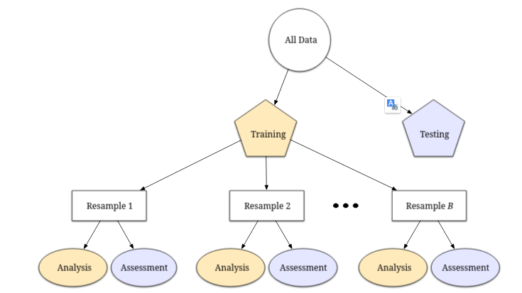
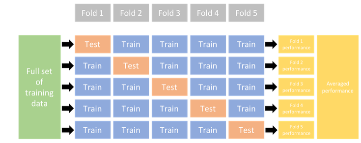

# Preprocesado

## Utilizando el paquete recipe


```{r}
library(tidymodels)
tidymodels_prefer() 
```

## ¿Qué es Feature Engineering?

::: {.columns}
::: {.column width="50%"}

Definición

Consiste en reformular y transformar los valores de los predictores para que un modelo estadístico o de Machine Learning pueda utilizarlos de forma más efectiva.

Objetivo Principal

Representar de la mejor manera las características más importantes de los datos para optimizar el rendimiento predictivo.
:::

::: {.column width="50%"}
::: {.callout-tip}

Ejemplo Sencillo: Ratios

Si tienes dos predictores cuantitativos en tu dataset (por ejemplo, habitaciones y superficie), crear un nuevo predictor con la razón o ratio entre ambos es una forma básica pero potente de feature engineering.
:::
:::
:::


## 📊 Resumen Exploratorio de Datos (`skimr`){.scrollable}

::: {.panel-tabset}

### Resumen General


```{r}
library(skimr)
prestamos_datos <- read.csv2("Datos/Prestamos_PP_BANK.csv")
prestamos_datos <- prestamos_datos |> 
  mutate(across(where(is.character), as.factor))
skim_res <-  skim(prestamos_datos)

# 1. Tabla de resumen general del dataset
summary(skim_res)
```
### Resumen numérico


```{r}
#| echo: false
# Extraer únicamente el bloque numérico en formato tabla
skim_res |>  
  yank("numeric") 
```

### Variables categóricas

```{r}
#| echo: false
# 3. Solo variables categóricas
skim_res |>  
  yank("factor") 
```

:::


## El Paquete recipes en Tidymodels

El paquete recipes es uno de los pilares fundamentales del ecosistema tidymodels (junto a parsnip para especificación de modelos).

::: {.columns}
::: {.column width="50%"}

**Ventajas Clave**

* 1.Unificación: Combina múltiples tareas de transformación en un único objeto.

* 2.Reutilización: Aplica la misma secuencia de transformaciones a nuevos conjuntos de datos.

:::

::: {.column width="50%"}

* 3.Evita Data Leakage: Garantiza que los parámetros de transformación se calculen solo con datos de entrenamiento.

:::

```{r}
#| echo: true
#| eval: false
# Estructura básica de recipe
mi_receta <- recipe(formula, data) %>%
  step_log(...) %>%
  step_dummy(...)

```

:::


## Integración recipe() en un Workflow

Para evitar filtración de datos y mantener el código limpio, se integra la receta y el modelo dentro de un workflow:


```{r}
#| echo: true
#| eval: false 
# 1. Especificar el modelo con parsnip
lm_spec <- linear_reg() |> 
  set_engine("lm")

# 2. Unir receta y modelo en un workflow
lm_wflow <- workflow() |>
  add_recipe(simple_ames) |>
  add_model(lm_spec)

# 3. Entrenar todo el workflow
lm_fit <- fit(lm_wflow, data = ames_train)

# 4. Predecir sobre datos de prueba (aplica la receta automáticamente)
predict(lm_fit, new_data = ames_test)

```


## Preprocesamiento Frecuente en Modelado

::: {.columns}
::: {.column width="50%" .fragment}

1. Reducción de Correlación

Uso de extracción de características (ej. PCA) o eliminación de variables redundantes.

2. Imputación de Faltantes

Estimación de valores ausentes mediante submodelos (KNN, árboles, medias).
:::

::: {.column width="50%" .fragment}

3. Transformación de Distribuciones

Uso de transformaciones logarítmicas o Box-Cox para corregir sesgos asimétricos.

4. Centrado y Escalado

Normalización de predictores numéricos cuando se emplean métricas de distancia geométrica.
:::
:::


# Principales step_* de recipes 


## 🏷️ Manejo de Categorías y Factores

::: {.incremental}
* **`step_unknown()`**
  * Convierte valores faltantes (`NA`) en niveles explícitos (por defecto *"unknown"*).
* **`step_novel()`**
  * Asigna una etiqueta predeterminada a niveles categóricos **nuevos** que aparezcan en el *test set* o en producción.
* **`step_other()`**
  * Agrupa categorías poco frecuentes en un nivel comodín (*"other"*), según un umbral (`threshold`) de frecuencia.
* **`step_dummy()`**
  * Convierte factores en variables binarias ($0$ o $1$).
  * Permite codificación tradicional ($K-1$ columnas) o *one-hot encoding* completo con `one_hot = TRUE`.
  
:::

## 🔢 Transformaciones Numéricas y Escalas

::: {.columns}

::: {.column width="50%"}
### Transformaciones
::: {.incremental}
* **`step_log()`**
  * Aplica transformación logarítmica para corregir asimetría (*skewness*).
  * Modifica la columna directamente *in-place*.
* **`step_mutate()`**
  * Crea nuevas variables derivadas (ej. ratios o razones entre variables existentes).
  
:::

:::

::: {.column width="50%"}
### Estandarización
::: {.incremental}
* **`step_center()`**
  * Resta la media a las variables numéricas (centrado en $0$).
* **`step_scale()`**
  * Divide por la desviación estándar (escalado a varianza $1$).
* **`step_normalize()`**
  * Combina `step_center()` + `step_scale()`.
:::

:::

:::


## 🧩 Imputación de Datos Faltantes

::: {.incremental}
* **Valores Centrales (Simples):**
  * **`step_impute_mean()`** / **`step_impute_median()`**: Imputa variables numéricas usando la media o la mediana del *train set*.
  * **`step_impute_mode()`**: Imputa la moda para variables categóricas o factores.

* **Basados en Algoritmos (Avanzados):**
  * **`step_impute_knn()`**: Imputa basándose en los $K$ vecinos más cercanos.
:::

::: {.fragment .callout-warning}
### ⚠️ Regla de Oro en `recipes`
Todas las estadísticas de imputación y escala (media, mediana, $SD$, vecinos) se calculan **únicamente sobre el conjunto de entrenamiento** (*train set*) para evitar la fuga de datos (*data leakage*).
:::


## 🧬 Extracción de Características (*Feature Extraction*)

::: {.columns}

::: {.column width="45%"}
### ¿Qué es?
::: {.callout-note icon=false}
Técnica para **condensar información** creando un número menor de nuevas variables a partir de los predictores originales.

* **Reducción de dimensión:** Comprime la información relevante.
* **Elimina la colinealidad:** Elimina la redundancia entre variables muy correlacionadas.
:::
:::

::: {.column width="55%"}
### Pasos de `recipes`

::: {.incremental}
* **`step_pca()` — Componentes Principales**
  * Método lineal donde cada componente es una combinación lineal de las originales.
* **`step_ica()` — Componentes Independientes**
  * Busca componentes estadísticamente independientes .
* **`step_nnmf()` — Factorización de Matrices No Negativas**
  * Útil para datos puramente positivos.
* **`step_mds()` — Escalado Multidimensional**
  * Preserva las distancias relativas entre observaciones en un espacio reducido.
:::
:::

:::

::: {.fragment .callout-tip}
### 💡 Recuerda en `tidymodels`:
Estas transformaciones deben aplicarse **después** de normalizar o estandarizar los datos (`step_normalize()`).
:::


## 📉 Pasos de Muestreo de Filas (*Row Sampling*)

::: {.callout-important icon=false}
### Desbalance de Clases
A diferencia de los pasos tradicionales, estas transformaciones **modifican las filas del conjunto de datos**. Se utilizan cuando una clase domina la muestra (ej. 95% *"No"* vs. 5% *"Sí"*).
:::

### Técnicas de Submuestreo (*Subsampling*)

::: {.incremental}
* **Bajo Muestreo (*Downsampling*):**
  * Conserva la clase minoritaria y reduce aleatoriamente las observaciones de la clase mayoritaria.
* **Sobre Muestreo (*Upsampling*):**
  * Duplica muestras de la clase minoritaria o sintetiza datos nuevos con características similares (ej. **SMOTE**).
:::


## 📉 Pasos de Muestreo de Filas (*Row Sampling*)(II)

::: {.callout-important icon=false}
### Desbalance de Clases
A diferencia de los pasos tradicionales, estas transformaciones **modifican las filas del conjunto de datos**. Se utilizan cuando una clase domina la muestra (ej. 95% *"No"* vs. 5% *"Sí"*).
:::

### Técnicas de Submuestreo (*Subsampling*)

::: {.incremental}

* **Métodos Híbridos:**
  * Combinan sobremuestreo de la clase minoritaria con bajo muestreo de la mayoritaria de forma simultánea.
:::

::: {.fragment .callout-note}
### 📦 Paquete `themis`
Para usar estas técnicas en `recipes`, se instalan y cargan las funciones del paquete adicional **`themis`** (ej. `step_downsample()`, `step_smote()`).

:::


## Procedimientos adquiridos datos prestamos


```{r}
prestamos_transf <- prestamos_datos |> mutate(cuota10 = log10(cuota))
prestamos_split <- initial_split(prestamos_transf, 
                                 prop = 0.7, 
                                 strata = plazo_meses
                                 )
prestamos_train <- training(prestamos_split)
prestamos_test  <- testing(prestamos_split)

```
## Agregamos el recipe

Incorporamos los pasos previos


```{r}
prestamo_reci <- recipe(cuota10 ~ ingreso_mensual + monto_prestamo +  plazo_meses + score_crediticio + edad + trabajo, data = prestamos_train)   |> 
  step_mutate(razpremon = monto_prestamo/ingreso_mensual) |> 
  step_log(monto_prestamo, base = 10) |> 
  step_normalize(all_numeric_predictors()) |>
  step_dummy(all_nominal_predictors()) 
tidy(prestamo_reci)
  # El preprocesamiento sólo ha sido definido
```

## Construcción del workflow


### Agregar el modelo


```{r}
lm_model <- linear_reg() |>
  set_engine("lm")
```


### Agregamos el recipe al workflow


```{r}
lm_wflow <- 
  workflow() |>
  add_model(lm_model) |>
  add_recipe(prestamo_reci)
```


## Ver los resultados del recipe

```{r}
# Para preparar la receta y ver los datos transformados:
prestamo_prep <- prep(prestamo_reci)
datos_procesados <- bake(prestamo_prep, new_data = NULL)

# Para inspeccionar los pasos aplicados:
tidy(prestamo_prep)
```

## Finalmente ajustamos todo

```{r}
lm_fit <- fit(lm_wflow, prestamos_train)
estimated_recipe <- 
  lm_fit |>
  extract_recipe(estimated = TRUE)

```


# Evaluación del modelo con yardstick


## Métricas de evaluación
> "Un enfoque cuantitativo nos permite entender el modelo, comparar diferentes enfoques y optimizar su rendimiento mediante **validación empírica**."

::: {.incremental}
* **Validación Empírica:** Evaluar la efectividad del modelo usando datos **no utilizados en el entrenamiento**.
* **Uso del conjunto de testeo:** Recordar que el conjunto de testeo solo se utiliza **una única vez**.
* **El paquete `yardstick`:** Herramienta central de `tidymodels` para medir el desempeño mediante estructuras de datos *tidy*.
:::

---

## ⚠️ La Elección de la Métrica Importa

Elegir la métrica incorrecta puede llevar a conclusiones erróneas al optimizar un modelo.

::: {.columns}

::: {.column width="50%"}
### **RMSE** (Precisión)
* Mide la magnitud del error ($y - \hat{y}$).
* Mayor variabilidad, pero **precisión uniforme** a lo largo de todo el rango de valores.
:::

::: {.column width="50%"}
### **$R^2$** (Correlación)
* Mide la correlación al cuadrado entre observados y predichos.
* Ajuste estrecho, pero puede **fallar drásticamente en los extremos** (colas).
:::

:::

> **Diferencia clave:** RMSE mide qué tan cerca están los valores; $R^2$ mide qué tan bien se mueven juntos.


## 📐 ¿Cómo se calculan RMSE y $R^2$?

### 1. RMSE (Root Mean Squared Error)
$$\text{RMSE} = \sqrt{\frac{1}{n} \sum_{i=1}^{n} (y_i - \hat{y}_i)^2}$$

* **¿Qué significa?** Es la desviación estándar de los residuos (errores de predicción). Expresa en las **mismas unidades que la variable respuesta** cuánto se equivoca el modelo en promedio.
* **Interpretación:** Cuanto más cercano a **0**, mejor. Penaliza severamente los errores grandes debido al cuadrado de la diferencia.

---

### 2. $R^2$ (Coeficiente de Determinación)
$$R^2 = 1 - \frac{\text{SS}_{\text{res}}}{\text{SS}_{\text{tot}}} = 1 - \frac{\sum (y_i - \hat{y}_i)^2}{\sum (y_i - \bar{y})^2}$$

* **¿Qué significa?** Es la proporción de la varianza total de la variable respuesta ($y$) que es explicada o capturada por el modelo ($\hat{y}$).
* **Interpretación:** Varía entre **0 y 1** (o $0\%$ y $100\%$). Un valor de $0.836$ indica que el modelo explica el $83.6\%$ de la variabilidad de los datos.

::: {.callout-tip}
### Resumen en una frase
El **RMSE** evalúa la **precisión** del modelo en la escala real de los datos, mientras que el **$R^2$** mide la **fuerza de la asociación lineal** entre lo observado y lo predicho.
:::


## 📏 Error Absoluto Medio (MAE)

### Fórmula
$$\text{MAE} = \frac{1}{n} \sum_{i=1}^{n} |y_i - \hat{y}_i|$$

::: {.columns}

::: {.column width="50%"}
### ¿Qué significa?
* Mide la **distancia absoluta promedio** entre  ($\hat{y}$) y 
* Está expresado  en las **mismas unidades** que la variable dependiente.
* **Fácil interpretación:** Es el "error promedio" directo.
:::

::: {.column width="50%"}
### MAE vs RMSE
* **Sin penalización cuadrática:** .
* **Robustez:** Es mucho **menos sensible a los valores atípicos (*outliers*)** que el RMSE.
* Si el dataset tiene valores atípicos  pero válidos, el MAE ofrece una mejor idea del "error típico".
:::

:::


## 🔬 Rendimiento e Inferencia

¿Tiene sentido usar métricas de predicción en un **modelo inferencial**? 


### Modelos Inferenciales
* Enfocados en entender relaciones y probar hipótesis (p-values).
* **Problema:** Un modelo estadísticamente significativo **no garantiza** que se ajuste bien a los datos.


> **Conclusión:** La fidelidad del modelo a los datos debe acompañar siempre a las conclusiones inferenciales.

---

## 💻 El Paquete `yardstick` en R

Las funciones de `yardstick` tienen una interfaz consistente orientada a *data frames*:

$$\text{funcion}(\text{data}, \text{truth}, \text{estimate})$$

::: {.incremental}
1. **`data`**: Tibble o data frame con los resultados.
2. **`truth`**: Columna con los valores reales observados ($y$).
3. **`estimate`**: Columna(s) con las predicciones del modelo ($\hat{y}$).
:::


## Evaluar la performance del modelo encontrado

```{r}
prestamo_test_res <- predict(lm_fit, 
                         new_data = prestamos_test |> 
                           select(-cuota10))
prestamo_test_res
```

##  Preparar los datos


```{r}
prestamo_test_res_fin <- bind_cols(prestamo_test_res, 
                                   prestamos_test |> 
                                     select(cuota10)
                         )
prestamo_test_res_fin      
```

## Gráficos utilizados

```{r}
prestamo_test_res_fin |> ggplot(aes(x = cuota10, y = .pred)) + 
  # Create a diagonal line:
  geom_abline(lty = 2) + 
  geom_point(alpha = 0.5) + 
  labs(y = "Cuota predicha(log10)", x = " Valor de cuota (log10)") +
  # Scale and size the x- and y-axis uniformly:
  coord_obs_pred()
```

## Cálculo de las métricas 

```{r}
prestamos_metrics <- metric_set(rmse, rsq, mae)
prestamos_metrics(prestamo_test_res_fin,
                  truth = cuota10, 
                  estimate = .pred)
```


## Gráfico de residuo en escala log
```{r}
# 1. Calcular el error al cuadrado por cada fila
prestamo_test_res_fin |>  mutate(    error_cuadrado = (cuota10 - .pred)^2  ) |>  ggplot(aes(x = cuota10, y = error_cuadrado)) +  geom_point(alpha = 0.5, color = "midnightblue") +  geom_hline(
    yintercept = mean((prestamo_test_res_fin$cuota10 - prestamo_test_res_fin$.pred)^2),     color = "firebrick", lty = 2, size = 1  ) +  labs(    title = "Distribución de Errores Cuadráticos Individuales",    subtitle = "La línea roja es el MSE (la raíz de esta línea es el RMSE final)",    x = "Cuota(log10)",
    y = "Error Cuadrático (y - ŷ)²"
  ) +  theme_minimal()
```

## Con la escala original


```{r}
prestamos_metrics_real <- metric_set(rmse, mae)
prestamo_test_res_real <- prestamo_test_res_fin |> 
  mutate(
  cuota_real = 10^(cuota10),
 pred_real  = 10^(.pred)
  ) 
prestamos_metrics_real(prestamo_test_res_real, 
                       truth =  cuota_real, 
                       estimate = pred_real )
```


## 🛠️ Ejercicioo:Ajustra un Modelo con `tidymodels`{.scrollable}

**Objetivo:** Crear un workflow que prediga el **precio de los diamantes** (`price`) según sus características  usando el dataset `diamonds`.

::: {.columns}

::: {.column width="50%"}
1. **División de Datos (`rsample`):**
   * Divide el dataset `diamonds` en un $80\%$ para entrenamiento y $20\%$ para prueba.

2. **Preprocesamiento (`recipes`):**
   * Crea una receta con la fórmula: `price ~ carat + cut + color + clarity`.
   * Aplica transformación $\log_{10}$ a la variable respuesta `price` y al predictor `carat`.
   * Pasa las variables categóricas a variables dummy (`step_dummy`).
:::

::: {.column width="50%"}
3. **Modelo (`parsnip`):**
   * Define un modelo de regresión lineal usando el motor `"lm"`.

4. **Flujo de Trabajo (`workflows`):**
   * Unir  receta y  modelo en un `workflow()` ajústar  datos de entrenamiento.

5. **Evaluación Empírica (`yardstick`):**
   * Genera las predicciones en el *test set* y calcula el $RMSE$, $MAE$ y $R^2$.
:::

:::


## 🔄 Métodos de Remuestreo (*Resampling*)

::: {.columns}


### ¿Qué es el Remuestreo?
::: {.callout-note icon=false}
Sistemas de simulación empírica que emulan el proceso de entrenar un modelo con ciertos datos y evaluarlo con datos diferentes.
:::

::: {.incremental}
* **Ocurre SOLO en el *Training Set*:** El *Test Set* nunca se toca durante este proceso.
* **Proceso Iterativo:** Se repite $B$ veces para obtener métricas estables.
* **Métrica Final:** Es el **promedio** de los $B$ resultados, logrando una excelente capacidad de generalización.

:::

:::


## Graficamente

{width="50%"}


## ⚔️ Terminología Clave: *Analysis* vs. *Assessment*

Para evitar confusiones con la división inicial (*Training* vs. *Testing*), en remuestreo usamos términos específicos:

::: {.columns}

::: {.column width="50%"}
::: {.callout-tip icon=false}
### 🏋️ Set de Análisis (*Analysis Set*)
* Análogo al **Training set**.
* Es la porción de datos utilizada para **ajustar/entrenar** el modelo en cada iteración.
* Típicamente representa la mayoría de los datos del *fold*.
:::
:::

::: {.column width="50%"}
::: {.callout-warning icon=false}
### 📏 Set de Evaluación (*Assessment Set*)
* Análogo al **Test set**.
* Es la porción **mutuamente excluyente** retenida para **calcular métricas** de rendimiento.
* Ningún dato del set de análisis está en el de evaluación.
:::
:::

:::

::: {.fragment .callout-important}
### 💡 La regla de oro
Si realizas 10 iteraciones, ajustarás **10 modelos independientes** sobre 10 *Analysis sets* y promediarás las 10 métricas obtenidas en sus respectivos *Assessment sets*.
:::

---

## 🎲 Validación Cruzada de $V$ Pliegues (*V-Fold Cross-Validation*)

::: {.columns}

::: {.column width="50%"}
### ¿Cómo funciona?

::: {.incremental}
1. El *Training Set* se divide al azar en $V$ partes de tamaño similar (**folds**).
2. En cada iteración $i$:
   * $1$ fold se reserva como **Assessment Set**.
   * Los $V-1$ folds restantes se unifican como **Analysis Set**.
3. Se repite $V$ veces hasta que todos los folds hayan sido el set de evaluación exactamente una vez.

:::

:::

::: {.column width="50%"}
### Elección del valor $V$

::: {.incremental}

* **$V = 3$:** Útil para explicaciones teóricas, pero **muy bajo en la práctica** (da estimaciones inestables).
* **$V = 10$ (Estándar):** Es el valor predeterminado recomendado en la práctica por equilibrar precisión y tiempo de cómputo.

:::

:::

:::


## Esquemáticamente 5 fold cross validation

{width="60%"}


## Validación cruzada en R


### En R (`rsample`):

```{r}
# Creación de 5 folds en tidymodels
prestamos_fold <- vfold_cv(prestamos_train, v = 5)
prestamos_fold
```


### Extraer info del primer fold:

```{r}
# Creación de 5 folds en tidymodels
prestamos_fold$splits[[1]] |>  analysis() |>  dim()
```


